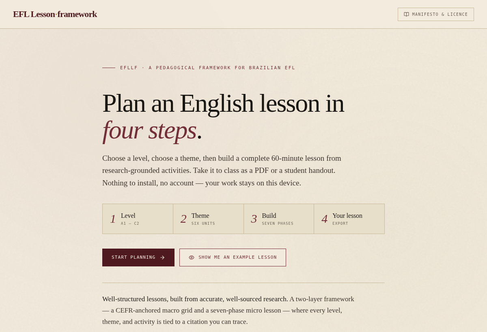
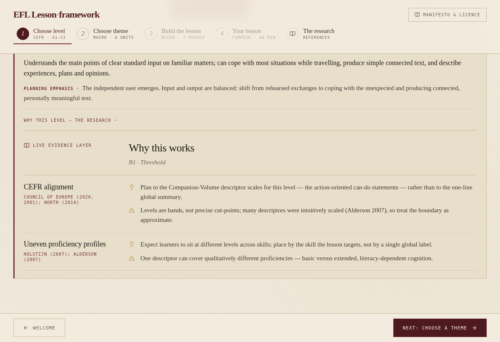
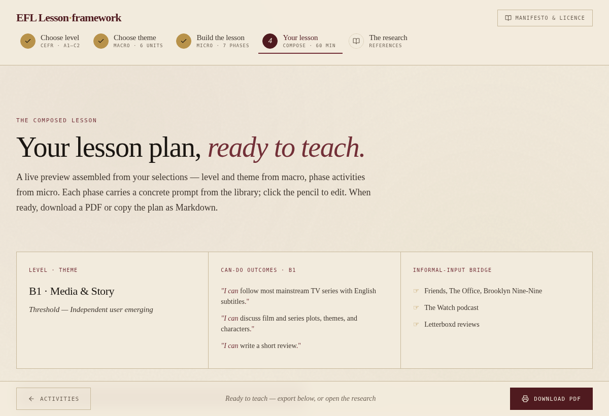
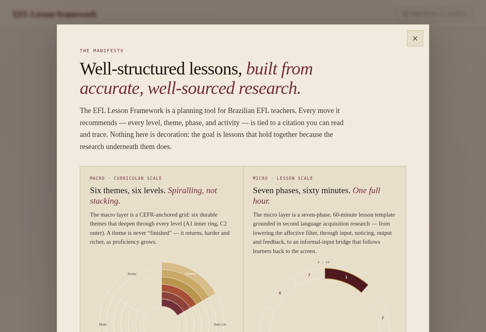

# EFL Lesson Framework

**Well-structured English lessons, built from accurate, well-sourced research.**

A guided planning tool for Brazilian EFL teachers. It pairs a **CEFR-anchored macro
grid** (six themes × six levels, A1–C2) with a **seven-phase, 60-minute micro lesson**
grounded in second language acquisition research — and ties every level, theme, and
activity to a citation you can read and trace.

Plan a complete lesson in four steps, then take it to class as a **PDF** or a
**student handout**. No install, no account — work stays on the device.

> 🔗 **English with Pedro** · https://pedrobritx.github.io/EwP/



---

## What it does

The framework works at two scales at once:

- **Macro · curricular scale** — a CEFR grid of six durable themes that *spiral* across
  levels (food at A1 → food sustainability at B2 → the philosophy of food at C1). Each
  level carries the official CEFR descriptor and a planning emphasis; each theme carries
  a needs-based rationale.
- **Micro · lesson scale** — a seven-phase, 60-minute lesson template, from lowering the
  affective filter through input, noticing, output, and feedback, to an **informal-input
  bridge** (Phase 7) that follows learners back to the screen.

Every step shows a concise description with an expandable **“Why this — the research”**
panel: the construct, the citation, the classroom implication, and an honest caveat.



## Plan a lesson in four steps

1. **Level** — pick a CEFR level (A1–C2). See what it means and the research behind it.
2. **Theme** — pick one of six thematic units. See why it was chosen.
3. **Build** — optionally say which of the unit's eight lessons this is, then step through the
   seven phases; a sensible activity is pre-selected per phase.
4. **Your lesson** — a live lesson plan and student handout, editable inline.



### Lessons within a unit

A unit is eight lessons, and each splits the same 60 minutes differently: lesson 1 spends 15
minutes on input and 10 on the communicative task; lesson 8 inverts that, with 25 on the task
and 5 on input. Picking an **archetype** on the Build step redistributes the seven phases
accordingly, and every export carries it.

It is optional. Leave it as *Standalone* and the lesson keeps the default split — which is
exactly what every previously saved lesson continues to do.

## The manifesto

A re-openable manifesto states the philosophy — the two-layer structure and three
commitments: *informal input is curricular*, *L1 is a resource*, and *variability is the
norm* — alongside the full dual-licence summary.



## Exports

- **Download PDF** opens the browser print dialog with a tuned `@media print`
  stylesheet — choose *Save as PDF*. The editorial design (Fraunces, Newsreader,
  paper / wine / gold) is preserved with selectable, vector text.
- **Copy as Markdown** copies the lesson plan or handout.

Every export carries the attribution credit (see the licence below). Chrome produces the
cleanest PDF; Safari and Firefox are close.

---

## Licence

This project is **dual-licensed** — see [LICENSE.md](./LICENSE.md) and
[TERMS.md](./TERMS.md) for the full text.

- ✅ **Free, with attribution** — individual teachers and tutors, public schools, and any
  institution that charges students **no tuition** may use, adapt, and share the framework
  and the lessons it produces.
- 💼 **Commercial licence required** — tuition-charging private schools, franchises, and
  commercial course providers need a paid, recurring commercial licence first. Pricing on
  request: **pedrobritx@gmail.com**.

**Required credit** on shared or exported materials:

> Created with EFL Lesson Framework — by pedrobritx · https://pedrobritx.github.io/EwP/

You may not resell or repackage the framework itself, remove the attribution, or use it to
train commercial AI models without written permission. These are the project's own terms,
provided as-is, and are not formal legal advice.

### Support

If the framework is useful to you, voluntary support is welcome (and is separate from the
commercial licence): ☕ **https://buymeacoffee.com/pedrobritx**

---

## Local development

Requires Node 20+.

```bash
npm install
npm run dev      # http://localhost:5173/
npm run build    # production bundle in dist/
npm run preview  # preview the production build
```

Lesson selections persist in `localStorage` under `lf-selections`; the wizard's
current step persists under `lf-wizard`. Clear selections with **Reset** at the bottom of
*Your lesson*, or run `localStorage.clear()` in the browser console.

## Deploy to GitHub Pages

The site deploys to the root of its own custom subdomain, **https://lessonframework.britx.me**,
rather than under a `/efl-lesson-framework/` path.

1. In **Settings → Pages**, set **Source** to **GitHub Actions** (one-time), and set the
   custom domain to `lessonframework.britx.me` (DNS + HTTPS are managed outside this repo).
2. `.github/workflows/deploy.yml` builds and deploys on every push to `main`.
3. `vite.config.js` defaults `base` to `/`, which is correct for root-of-domain hosting. To
   build instead for a path-based deployment (e.g. a plain `https://<username>.github.io/efl-lesson-framework/`
   project page, with no custom domain), set `VITE_BASE_PATH=/efl-lesson-framework/` when
   running `npm run build`.

## Project structure

```
src/
├── App.jsx                  # the guided wizard + composer
├── components/              # diagrams, evidence panels, manifesto, licence notice
├── data/
│   ├── themes.js            # 6 thematic units (+ rationale, evidence)
│   ├── levels.js            # 6 CEFR levels (+ descriptor, evidence)
│   ├── macro.js             # 6×6 can-do + bridge matrix
│   ├── phases.js            # 7 phases + activity options
│   ├── evidence.js          # SLA evidence model
│   ├── references.js        # annotated bibliography (CEFR, thematic, SLA)
│   └── credit.js            # attribution / licence strings
├── hooks/                   # selections + wizard state
├── styles/                  # editorial design system + @media print
└── wizard/steps.js          # step model
```

## Credits

A framework by **English with Pedro** (Pedro Henrique Bahia Brito). Grounded in the SLA,
CEFR, and critical-literacy scholarship documented in *The research* step and the
annotated bibliography — Council of Europe · Krashen · Long · Swain · Vygotsky · Lantolf ·
Norton · Darvin · Dörnyei · Schmidt · Lyster · Ellis · Nation · Laufer & Hulstijn ·
García & Wei · Larsen-Freeman · Nayar · Menezes de Souza & Monte Mór.
